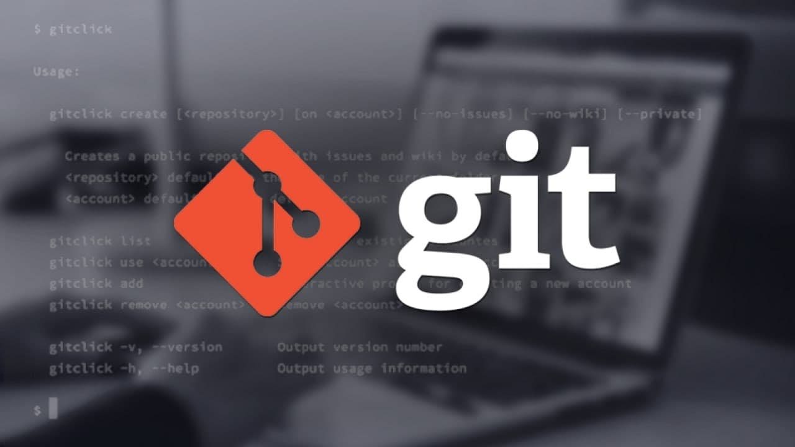

# Возможности Markdown

### **Что такое Markdown?**

*Markdown* - язык текстовойразметки, созданный писателем и блогером Джоном Грубером. Он предназначен для создания красиво оформленных текстов в обычных файлах формата TXT. Вам не нужны громоздкие процессоры вроде Word или Pages, чтобы создать документы с жирным или курсивным начертанием, цитатами, ссылками и даже таблицами.

Этот язык разметки используется блогерами, писателями, редакторами и журналистами по всему миру. Всем, кто так или иначе связан с упомянутыми профессиями, будет полезно знать о нём.

### **Преимущество Markdown**

1. *Универсальность.* Документы, написанные с использованием синтаксиса Markdown, представляют соой обычные текстовые файлы TXT. Их можно открывать на любой платформе и в любом редакторе.

2. *Простота.* Markdown настолько прост, что его смогут освоить даже те, кто до этого не слышал про все эти ваши Latex и HTML.

3. *Большой выбор инструментов.* Редакторов для работы с документами Markdown очень, очень много. Есть и онлайновые, и мобильные, и настольные инструменты.

4. *Конвертируемость.* Документы Markdown легко экспортировать в любые форматы: PDF, DOC, ODT.

### **Недостатки Markdown**

1. *Ограниченность форматирования.* Так как документы Markdown представляют собой просто текстовые файлы, красивых шрифтов в них не применишь. Всё-таки это скорее инструмент для написания черновиков, чем для полноценной вёрстки.

2. *Строгие правила в Markdown.* Текст оформляется посредством служебных символов. Один лишний знак * или #, и форматирование изменится. Так что при наборе текстов в Markdown придётся быть внимательным.

# Работа с Git 

**Git** — это распределенная система контроля версий нашего кода. Зачем она нам? Для распределенных команд нужна какая-то система управления работы. Нужна, чтобы отслеживать изменения, которые происходят со временем. 

То есть шаг за шагом мы видим, какие файлы изменились и как. Особенно это важно, когда анализируешь, что было проделано в рамках одной задачи: это дает возможность возвращаться назад.

