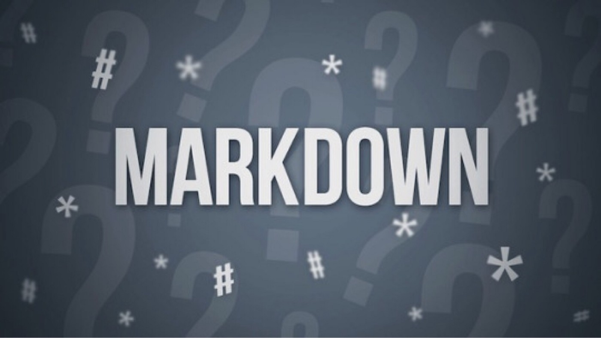

# Возможности Markdown

### **Что такое Markdown?**

*Markdown* - язык текстовойразметки, созданный писателем и блогером Джоном Грубером. Он предназначен для создания красиво оформленных текстов в обычных файлах формата TXT. Вам не нужны громоздкие процессоры вроде Word или Pages, чтобы создать документы с жирным или курсивным начертанием, цитатами, ссылками и даже таблицами.

### **Преимущество Markdown**

1. *Универсальность.* Документы, написанные с использованием синтаксиса Markdown, представляют соой обычные текстовые файлы TXT. Их можно открывать на любой платформе и в любом редакторе.

2. *Простота.* Markdown настолько прост, что его смогут освоить даже те, кто до этого не слышал про все эти ваши Latex и HTML.

3. *Большой выбор инструментов.* Редакторов для работы с документами Markdown очень, очень много. Есть и онлайновые, и мобильные, и настольные инструменты.

4. *Конвертируемость.* Документы Markdown легко экспортировать в любые форматы: PDF, DOC, ODT.

